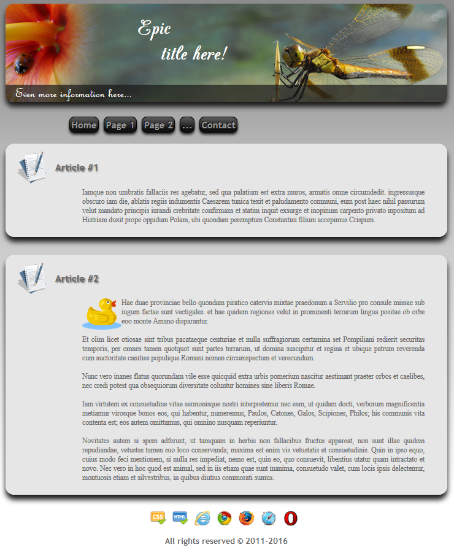

# Website template

## What is it?

This project is a template for most of my websites.

It is a basic example to easily create website.

Example of websites using this template:
 - https://quentin.comte-gaz.com
 - https://teamspeak.comte-gaz.com

## How to install

1) Download this project

2) Edit metadata, links and menu in <a target="_blank" href="https://github.com/QuentinCG/Website-Template/blob/master/header.php">header.php</a>

3) Edit the <a target="_blank" href="https://github.com/QuentinCG/Website-Template/blob/master/index.php">main page</a>, the <a target="_blank" href="https://github.com/QuentinCG/Website-Template/blob/master/contact.php">contact page</a> and all other pages you want to add (with same pattern as the main page)

4) Change the <a target="_blank" href="https://github.com/QuentinCG/Website-Template/blob/master/images/banner.jpg">banner</a>, the <a target="_blank" href="https://github.com/QuentinCG/Website-Template/blob/master/favicon.png">favicon</a> and the <a target="_blank" href="https://github.com/QuentinCG/Website-Template/blob/master/images/mail.png">email address</a>

5) Store the website in a PHP compatible web server

6) Enjoy :)

## License

This project is under MIT license. This means you can use it as you want (just don't delete the library header).

Note that this project uses Third party JS scripts and fonts:
 - <a target="_blank" href="https://jquery.org/license/">JQuery (JS)</a>: MIT license
 - <a target="_blank" href="https://github.com/sksmatt/UItoTop-jQuery-Plugin/">jQuery topLink plugin (JS)</a>: GNU license
 - <a target="_blank" href="https://github.com/QuentinCG/Website-Template/tree/master/fonts">Fonts</a>: "Freeware" license

## Contribute

If you want to improve this website, just create a pull request with proper commit message and right wrapping.
